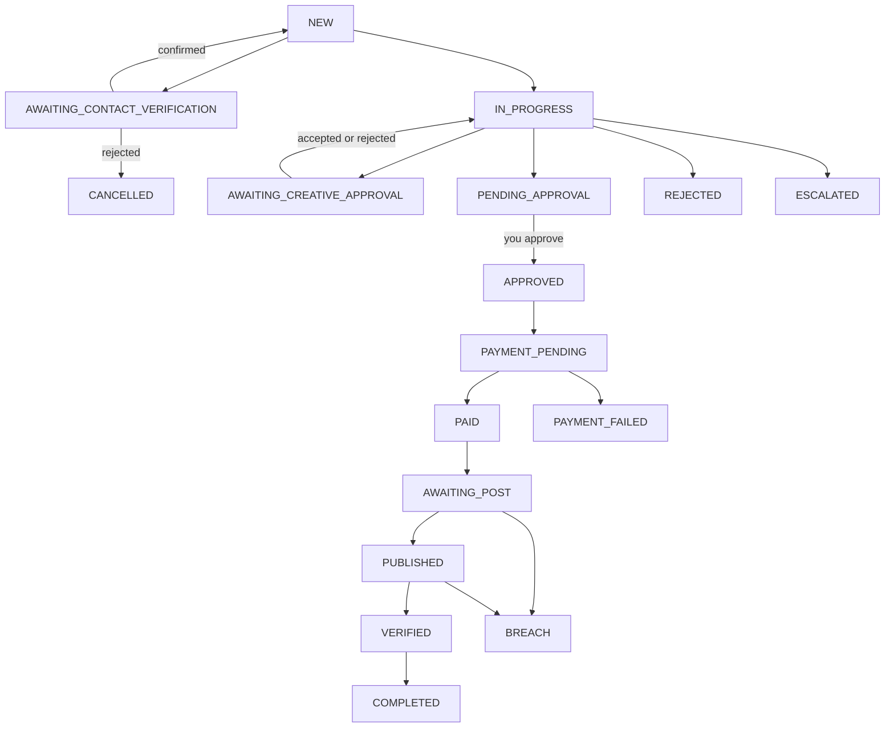

A placement is where the work actually happens: an AI agent contacts the channel owner in Telegram, agrees a price and a date, and brings the result back for a human decision.

## The lifecycle



### Working states

| Status | What is happening |
|---|---|
| `NEW` | Created, waiting to be handed to the agent. |
| `AWAITING_CONTACT_VERIFICATION` | Held before handoff while a human verifies the channel's manager contact. Confirming returns it to `NEW`; rejecting cancels it. |
| `IN_PROGRESS` | The agent is negotiating with the channel owner. |
| `AWAITING_CREATIVE_APPROVAL` | The owner proposed his own wording. **Both** outcomes return the placement to `IN_PROGRESS` and the agent resumes the same conversation, so the deal is never lost over an edit. |
| `PENDING_APPROVAL` | A price and date are agreed and it is waiting on you. |
| `APPROVED` | You approved. Money is now reserved and the payout flow begins. |
| `PAYMENT_PENDING` → `PAID` | Paying the channel owner. |
| `AWAITING_POST` → `PUBLISHED` → `VERIFIED` | Waiting for the post, then confirming it went up as agreed. |

### Terminal states

| Status | Meaning |
|---|---|
| `COMPLETED` | Ran and settled. |
| `REJECTED` | The channel owner declined. `rejectionReason` says why. |
| `ESCALATED` | Handed to a human. `escalationReason` and `escalationUrgency` carry the detail. |
| `CANCELLED` | Cancelled by you, or the contact was rejected at verification. |
| `PAYMENT_FAILED` | The payout was declined or definitively failed. The committed budget is released, and the placement never blocks the campaign from settling. |
| `BREACH` | The owner took the money and did not deliver as agreed. |

## Listing them

```bash
curl "$AFLUX_API/campaigns/$CAMPAIGN_ID/placements" -H "Authorization: Bearer $AFLUX_KEY"
```

```json
{
  "items": [ { "id": "…", "channelUsername": "ton_daily", "status": "PENDING_APPROVAL",
               "agreedCost": "85.00", "agreedDate": "2026-09-18", "agreedSummary": "…" } ],
  "queued": [ { "channelId": 5678, "subscribers": 31200, "expectedViews": 9800 } ]
}
```

### The queue

`queued` is the ranked tail of the approved match set that did not fit the active-placement limit. **The array order is the order they will be taken in** — the next freed slot goes to the first entry.

<Warning>
  Nothing in the queue is guaranteed. It stops being consumed the moment the remaining budget no longer covers the next channel, or the campaign's date window closes. Whatever is left then is simply never bought.
</Warning>

## Approving a deal

```bash
curl -X POST "$AFLUX_API/campaign-placements/$PLACEMENT_ID/approve" \
  -H "Authorization: Bearer $AFLUX_KEY"
```

Read `agreedCost`, `agreedDate` and `agreedSummary` first — that is what you are approving. Approval is what moves money from the campaign's `remaining` into `reserved`.

## Rejecting a creative change

When a placement sits in `AWAITING_CREATIVE_APPROVAL`, it carries both texts: `originalAdCopy` (yours) and `proposedAdCopy` (his). Keep yours with:

```bash
curl -X POST "$AFLUX_API/campaign-placements/$PLACEMENT_ID/creative-change/reject" \
  -H "Authorization: Bearer $AFLUX_KEY"
```

Either way the agent goes back to negotiating. If the change is accepted, the accepted text appears as `approvedAdCopy` and is what gets published.

## Cancelling

```bash
curl -X POST "$AFLUX_API/campaign-placements/$PLACEMENT_ID/cancel" \
  -H "Authorization: Bearer $AFLUX_KEY"
```

## Reading the conversation

Every message between the agent and the channel owner is available:

```bash
curl "$AFLUX_API/campaign-placements/$PLACEMENT_ID/messages" -H "Authorization: Bearer $AFLUX_KEY"
```

Each message has a `role` of `manager` (the channel owner) or `assistant` (the Aflux agent), plus `text` and `messageAt`. The response pages with `nextCursor`.

## Channel facts on a placement

| Field | What it is |
|---|---|
| `subscribers` | Subscriber count as measured by the parser. |
| `avgReach` | Average views of an ordinary post. |
| `avgAdReach24h` | Average views an **ad** post collects in its first 24h. Null for channels with no measured ad posts. |
| `expectedViews` | The forecast — `avgAdReach24h`, or `avgReach` when that was never measured. Null (never `0`) when the channel carries no usable reach. |
| `views` / `reactions` | Measured on the published post. Null until it is published and the first snapshot arrives. |
| `clicks` / `uniqueClicks` | Measured on our redirect. Null (never `0`) while nothing has been clicked. |
